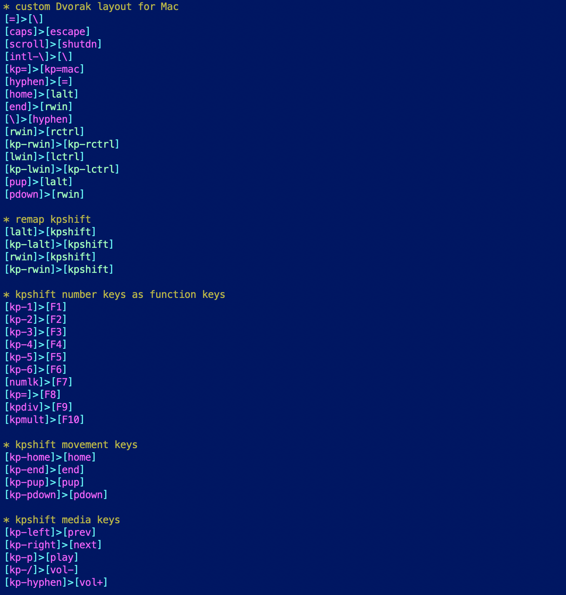

# vim-advantage2

Vim syntax highlighting of layout files for the
[Kinesis](https://kinesis-ergo.com)
[Advantage2](https://kinesis-ergo.com/shop/advantage2/) keyboard.

## Installation

### with a package installer

Clone the repository in the bundle directory of your favorite Vim
package installer like [pathogen](https://github.com/tpope/vim-pathogen)
or [Vundle](https://github.com/VundleVim/Vundle.Vim)

### manually

Put the `syntax/kinesis.vim` file in your user runtime directory where syntax
files are searched for by Vim (normally `$HOME/.vim/syntax`).

To have Vim automatically detect the type of file, add the line
```vim
autocmd BufNewFile,BufRead ?_{qwerty,dvorak}.txt,{qwerty,dvorak}.txt set filetype=advantage2
```
in your `.vimrc` or in the file `filetype.vim` in your user runtime directory
(normally `$HOME/.vim`).

## Screenshot



## License

See [LICENSE.txt](LICENSE.txt).
